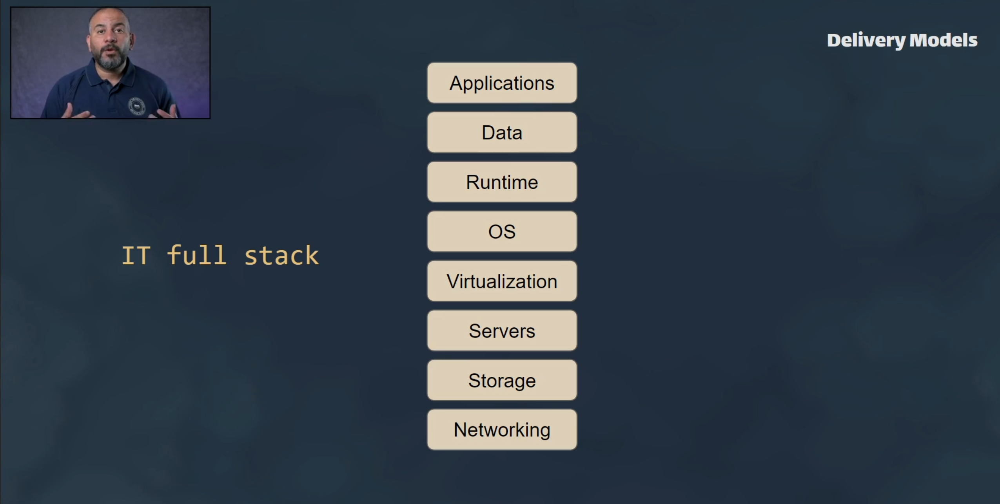
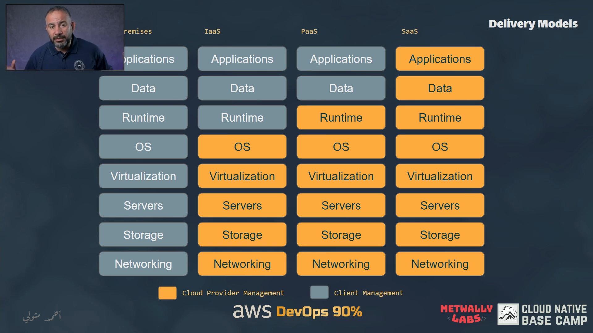

### 02-Cloud Delivery Models

#### IT Full Stack

#### On-Premises Model

- All the resources there are in the client management.

#### Infrastructure as a Service (IaaS)

- The provider offers the infrastructure [Network, Storage, Servers, Virtualization, OS].
- The client manages the [applications, data, runtime].

#### Platform as a Service (PaaS)

- The provider offers the platform [Network, Storage, Servers, Virtualization, OS, Middleware, Runtime].
- Tje client manages the [applications, data].

#### Software as a Service (SaaS)

- The provider offers the software [Network, Storage, Servers, Virtualization, OS, Middleware, Runtime, Data, Applications].
- The client manages nothing.

### 03-AWS Global Infrastructures

#### What is Region?

- A region is a geographical area where AWS has a data center. and every region has multiple availability zones. minimum 3 AZs.

#### What is Availability Zone?

- An availability zone is one or more data centers with redundant power, networking, and connectivity in an AWS region.

#### What is Global edge locations?

- Global edge locations are CDN (Content Delivery Network) endpoints for CloudFront. They are used for caching content. to reduce latency.

#### What is AWS Local Zones?

- AWS Local Zones place AWS compute, storage, database, and other select services closer to large population, industry, and IT centers. and connected to nearest AWS region.

**Example: why there Local Zone**

- To serve application it's has sensitive data and need to be close to the user like financial application.

#### What is AWS Wavelength?

- AWS Wavelength is an AWS infrastructure deployment that places compute and storage services at the edge of telecommunications providers' 5G networks. This allows developers to build applications that require ultra-low latency. until from Local Zone.

#### What is AWS Regional Services?

- AWS Regional Services are services that are accessed from within a specific region. These services do not go over the public internet.

#### 04- Shared Responsibility Model

#### 06- IAM Service Introduction

#### 07- IAM Resources

**Wheat is ARN ?**

- Amazon Resource Name (ARN) is a unique identifier that unambiguously identifies a resource.

##### Users Groups in IAM Service:

- Groups: A collection of users. Each user in the group will inherit the permission of the group.

##### Users in IAM Service:

- Users: A user is an entity that you create in AWS to represent the person or service that uses it. can give it directly permission. or add it to group. to inherit the permission of the group.

##### Roles in IAM Service:

- Roles: A role is an entity that has its own permission. and can be assumed by another entity. like user, service, VM, or application.

##### Policies in IAM Service:

- Policies: A policy is a document that defines one or more permissions. and can be attached to a user, group, or role. maybe grant or deny permission.

##### What is principle?

- any role or user send request to AWS service.
- the principle is the entity that is making the request.

**NOTE: When any principle send request**

- IAM Service will check the permission of the principle.
  - if the principle has permission (Authentication) the request will be accepted.
  - What need this principle to do the request? (Authorization)
  - if the principle has no permission (Authorization) the request will be denied.
  - if the principle need do two request. and does not have permission for one of them. all request will be denied.
  - if the principle need to do tow actions one of them is denied. and the other is allowed to the same resource. the request will be denied. otherwise, the order of the request will be accepted.
