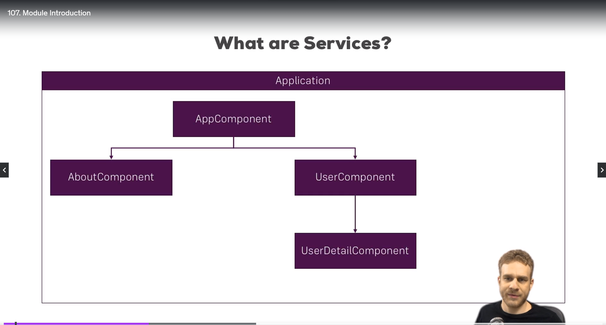
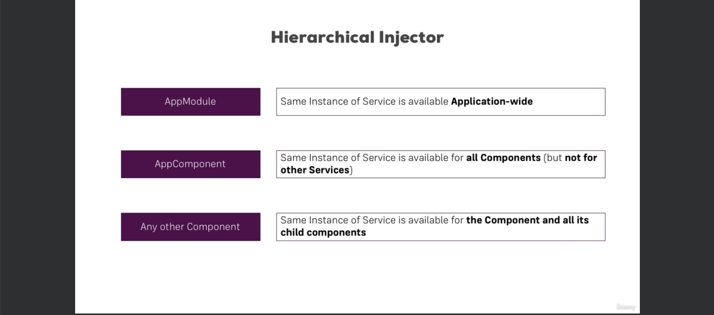

# **Section 9:**

## **107: Using services and dependency injection**

- What is a service?
  

- if we want log date from about component and user details component, we can create a service and inject it into both components instead of duplicating the code in both components. so we use providers data instead of duplicating the code.

- **108: Why would you need a service?**
- if we want to share data between components, we can use service.

### **109: Creating a logging service**

```ts
// in LoggingService.ts
export class LoggingService {
  logStatusChange(status: string) {
    console.log('A server status changed, new status: ' + status);
  }
}

// in new-account.component.ts
@Component({
  selector: 'app-new-account',
  templateUrl: './new-account.component.html',
  styleUrls: ['./new-account.component.css']
})
export class NewAccountComponent {
  @Output() accountAdded = new EventEmitter<{name: string, status: string}>();

  onCreateAccount(accountName: string, accountStatus: string) {
    this.accountAdded.emit({
      name: accountName,
      status: accountStatus
    });
    // console.log('A server status changed, new status: ' + accountStatus);
    const service = new LoggingService();
    service.logStatusChange(accountStatus);
  }
}
`
- But this way doesn't good because we have to create a new `instance` of this service in each component. but angular has a better way to do this.
`ts
// in new-account.component.ts
@Component({
  selector: 'app-new-account',
  templateUrl: './new-account.component.html',
  styleUrls: ['./new-account.component.css']
})
export class NewAccountComponent {
  @Output() accountAdded = new EventEmitter<{name: string, status: string}>();
  // loggingService?: LoggingService;
  constructor(private loggingService: LoggingService) {}

  onCreateAccount(accountName: string, accountStatus: string) {
    this.accountAdded.emit({
      name: accountName,
      status: accountStatus
    });
    // console.log('A server status changed, new status: ' + accountStatus);
    // const service = new LoggingService();
    // service.logStatusChange(accountStatus);
    this.loggingService.logStatusChange(accountStatus);
    // There another way to inject service using @inject
    # this.loggingService = @inject(LoggingService);
  }
}
```

- In this case service not working because hierarchy of components is not correct. in this case we override of `providers` in `app.component.ts`. so we have to remove `providers` from `account.component.ts` and `new-account.component.ts`



## **115: Injecting Service into Services**

- We don't add @Injectable to the service you want to inject, but to the service where you want to inject something. So the receiving service you could say, that to be injected in service.

- To make all application have the same instance of the service unless it overrides we provide the service insider Provider array in out appModule

## **116: Using Services for Cross-Component Communication**

- We can use service for cross-component communication. for example we can use service for cross-component communication between `account.component.ts` and `new-account.component.ts` instead of using `@Output` and `@Input` decorator.

Example:

```ts
// statusUpdate = new EventEmitter<string>;

// In Account.Component.ts
this.accountsService.statusUpdate.emit(status)

// In new-account.component.ts
constructor(private accountsService: AccountsService) {
 this.accountsService.statusUpdate.subscribe(
 (status: string) => alert('New Status ' + status)
 )
}
```

# **Section 11: Changing Pages With Routing**

### **130 setting up and loading routes**

- we create our routes in `app.module.ts` file using Routes array and `RouterModule.forRoot()` method.
- We can use `RouterModule.forRoot()` to define routes in `app.module.ts` file.
- We can use `RouterModule.forChild()` to define routes in feature module.
- We can use `routerLink` directive to navigate between routes.
- We can use `router-outlet` directive to load component based on the route.

### **132: Understanding Navigation Paths**

- We can use `routerLink` directive to navigate between routes.
- We can use absolute path and relative path to navigate between routes.
- Absolute path: `/servers`
- Relative path: `servers`
- `./servers` means current path
- `../servers` means parent path.

### **133: Styling Active Router Links**

- We can use `routerLinkActive` directive to style active router links.
- We user [routerLinkActiveOptions]="{exact: true}" to style active router links. to match the exact path. not contain the path.

### **134: Navigating Programmatically**

- We can use `router.navigate()` method to navigate programmatically.
- We can use `router.navigate(['/servers'])` to navigate to `/servers` route.
- We can use `router.navigate(['/servers', id, 'edit'])` to navigate to `/servers/:id/edit` route.

### **135: Using Relative Paths in Programmatic Navigation**

- We can use relative path in `router.navigate()` method to navigate programmatically.
- We can use `this.router.navigate(['servers']})` to navigate to `/servers` route.
- We can use `this.router.navigate(['servers'], {relativeTo: this.route})` to navigate to `/servers/servers` route.
- We can use `this.router.navigate(['edit'], {relativeTo: this.route})` to navigate to `/servers/:id/edit` route.

### **136: Passing Parameters to Routes**

- We can use write dynamic routes using `:id` in the route path.
- We can use `this.route.snapshot.params['id']` to get the route parameter.
- We can use `this.route.params.subscribe()` to subscribe to route parameter changes.
- Example:
  `ts
this.route.params.subscribe((params: Params) => {
  this.id = +params['id'];
});
`

### **137: Fetching Route Parameters**

- We can use `this.route.snapshot.params['id']` to get the route parameter.
- We can use `this.route.params.params['name']` to get the route parameter. `/id/name`

### **138: Fetching Route Parameters Reactively**

- We can use `this.route.params.subscribe()` to subscribe to route parameter changes.
- Example:
  `ts
this.route.params.subscribe((params: Params) => {
  this.id = +params['id'];
  this.name = params['name'];
});
`

- We can use `this.route.queryParams.subscribe()` to subscribe to route query parameter changes.
- Example:
  `ts
this.route.queryParams.subscribe((queryParams: Params) => {
  this.allowEdit = queryParams['allowEdit'] === '1' ? true : false;
});
`

### **139: An Important Note about Route Observables**

- We should unsubscribe from route observables to prevent memory leaks.
- We can user `Subscription` to unsubscribe from route observables.
- Example:

```ts
subscription: Subscription

ngOnInit() {
  this.subscription = this.route.params.subscribe((params: Params) => {
  this.id = +params['id'];
  this.name = params['name'];
});
}

ngOnDestroy() {
  this.subscription.unsubscribe();
}

```

- **The last step not necessary because angular will do it for us. but if we build out own observables we have to unsubscribe from it.**

### **140: Passing Query Parameters and Fragments**

- We can use `queryParams` property to pass query parameters to the route.
- We can use `fragment` property to pass fragment to the route.
- Example:
  ```ts
  this.router.navigate(['/servers', id, 'edit'], {queryParams: {allowEdit: '1'}, fragment: 'loading'});
  // Or In HTML
  <a [routerLink]="['/servers', server.id, 'edit']" [queryParams]="{allowEdit: '1'}" fragment="loading">
    Edit
  ```

### **143: Setting up Child (Nested) Routes**

- We can use `children` property to define child routes.
- We can use `router-outlet` directive to load child routes.
- Example:

  ```ts
  const appRoutes: Routes = [
    {
      path: 'servers',
      component: ServersComponent,
      children: [
        { path: ':id', component: ServerComponent },
        { path: ':id/edit', component: EditServerComponent },
      ],
    },
    { path: 'users', component: UsersComponent },
  ]
  ```

  ```html
  <div class="col-xs-12 col-sm-4">
    <!-- <app-user></app-user> -->
    <router-outlet></router-outlet>
  </div>
  ```

- router-outlet is a directive that tells Angular where to place the component that is loaded based on the current route. So it's a placeholder where Angular will render the component that should be displayed for the current route.

### **144: Using Query Parameters - Practice**

- We can use `queryParams` property to pass query parameters to the route.
- We can use `fragment` property to pass fragment to the route.
- Example:
  ```ts
  this.router.navigate(['/servers', id, 'edit'], {queryParams: {allowEdit: '1'}, fragment: 'loading'});
  // Or
  this.router.navigate(['edit'], {relativeTo: this.route, queryParams: {allowEdit: '1'}, fragment: 'loading'});
  // Or In HTML
  <a [routerLink]="['/servers', server.id, 'edit']" [queryParams]="{allowEdit: '1'}" fragment="loading">
    Edit
  ```

### **145: Configuring the Handling of Query Parameters**

#### What is queryParamsHandling and why we use it?

- The queryParamsHandling option in the Angular Router.navigate() method is used to control how query parameters are handled when navigating to a new route. Here's a brief explanation:

  - preserve: This option instructs Angular to preserve the query parameters from the current URL when navigating to the new route. It ensures that any query parameters present in the current URL are carried over to the destination route.

  - merge: This option merges any new query parameters specified in the navigation with the existing query parameters in the current URL. If a query parameter with the same name already exists in the current URL, its value will be replaced with the new value.

  - null: This option tells Angular to discard any query parameters from the current URL when navigating to the new route. It essentially clears out any existing query parameters.

**The reason we use queryParamsHandling is to maintain or manipulate the query parameters during navigation. For example, if you're navigating to a new route but want to keep certain query parameters intact, you would use queryParamsHandling: 'preserve'. This ensures that the user's context, as represented by the query parameters, remains consistent across different routes.**

- We can use `queryParamsHandling` property to configure the handling of query parameters.
- We can use `preserve` value to preserve the query parameters.
- Example:
  ```ts
  this.router.navigate(['/servers', id, 'edit'], {
    queryParams: { allowEdit: '1' },
    queryParamsHandling: 'preserve',
  })
  ```
- We can use `merge` value to merge the query parameters.
- Example:
  ```ts
  this.router.navigate(['/servers', id, 'edit'], {
    queryParams: { allowEdit: '1' },
    queryParamsHandling: 'merge',
  })
  ```

### **146: Redirecting and Wildcard Routes**

- We can use `redirectTo` property to redirect to another route.
- We can use `pathMatch` property to match the path.
- We can use `**` to match any route.
- Example:
  ```ts
  const appRoutes: Routes = [
    { path: '', component: HomeComponent },
    { path: 'not-found', component: PageNotFoundComponent },
    { path: '**', redirectTo: '/not-found' },
  ]
  ```
- If user enter any route that not exist, it will redirect to `not-found` route.
