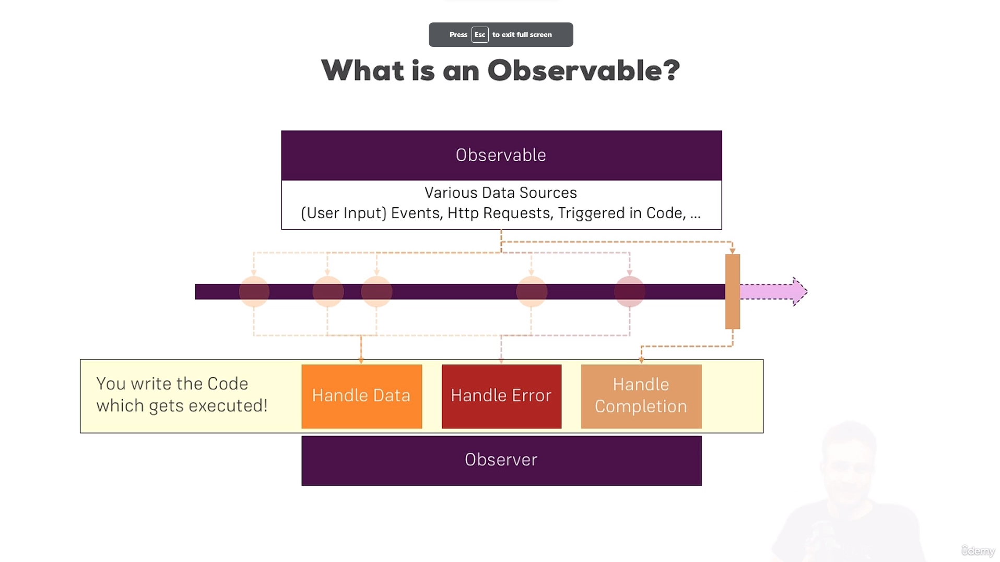
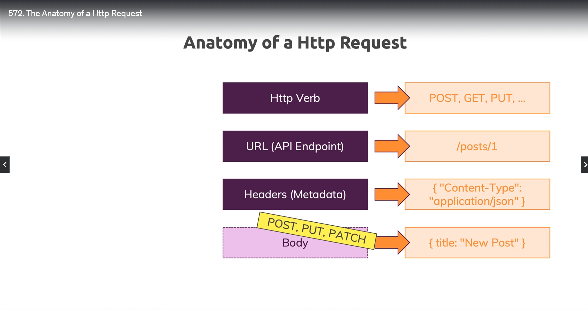
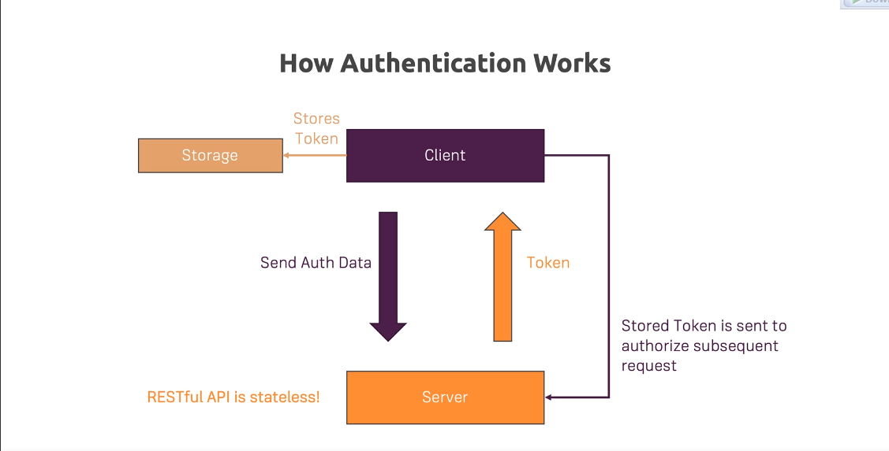

# **Section 9:**

## **107: Using services and dependency injection**

- What is a service?
  

- if we want log date from about component and user details component, we can create a service and inject it into both components instead of duplicating the code in both components. so we use providers data instead of duplicating the code.

- **108: Why would you need a service?**
- if we want to share data between components, we can use service.

### **109: Creating a logging service**

```ts
// in LoggingService.ts
export class LoggingService {
  logStatusChange(status: string) {
    console.log('A server status changed, new status: ' + status);
  }
}

// in new-account.component.ts
@Component({
  selector: 'app-new-account',
  templateUrl: './new-account.component.html',
  styleUrls: ['./new-account.component.css']
})
export class NewAccountComponent {
  @Output() accountAdded = new EventEmitter<{name: string, status: string}>();

  onCreateAccount(accountName: string, accountStatus: string) {
    this.accountAdded.emit({
      name: accountName,
      status: accountStatus
    });
    // console.log('A server status changed, new status: ' + accountStatus);
    const service = new LoggingService();
    service.logStatusChange(accountStatus);
  }
}
`
- But this way doesn't good because we have to create a new `instance` of this service in each component. but angular has a better way to do this.
`ts
// in new-account.component.ts
@Component({
  selector: 'app-new-account',
  templateUrl: './new-account.component.html',
  styleUrls: ['./new-account.component.css']
})
export class NewAccountComponent {
  @Output() accountAdded = new EventEmitter<{name: string, status: string}>();
  // loggingService?: LoggingService;
  constructor(private loggingService: LoggingService) {}

  onCreateAccount(accountName: string, accountStatus: string) {
    this.accountAdded.emit({
      name: accountName,
      status: accountStatus
    });
    // console.log('A server status changed, new status: ' + accountStatus);
    // const service = new LoggingService();
    // service.logStatusChange(accountStatus);
    this.loggingService.logStatusChange(accountStatus);
    // There another way to inject service using @inject
    # this.loggingService = @inject(LoggingService);
  }
}
```

- In this case service not working because hierarchy of components is not correct. in this case we override of `providers` in `app.component.ts`. so we have to remove `providers` from `account.component.ts` and `new-account.component.ts`


## **115: Injecting Service into Services**

- We don't add @Injectable to the service you want to inject, but to the service where you want to inject something. So the receiving service you could say, that to be injected in service.

- To make all application have the same instance of the service unless it overrides we provide the service insider Provider array in out appModule

## **116: Using Services for Cross-Component Communication**

- We can use service for cross-component communication. for example we can use service for cross-component communication between `account.component.ts` and `new-account.component.ts` instead of using `@Output` and `@Input` decorator.

Example:

```ts
// statusUpdate = new EventEmitter<string>;

// In Account.Component.ts
this.accountsService.statusUpdate.emit(status)

// In new-account.component.ts
constructor(private accountsService: AccountsService) {
 this.accountsService.statusUpdate.subscribe(
 (status: string) => alert('New Status ' + status)
 )
}
```

# **Section 11: Changing Pages With Routing**

### **130 setting up and loading routes**

- we create our routes in `app.module.ts` file using Routes array and `RouterModule.forRoot()` method.
- We can use `RouterModule.forRoot()` to define routes in `app.module.ts` file.
- We can use `RouterModule.forChild()` to define routes in feature module.
- We can use `routerLink` directive to navigate between routes.
- We can use `router-outlet` directive to load component based on the route.

### **132: Understanding Navigation Paths**

- We can use `routerLink` directive to navigate between routes.
- We can use absolute path and relative path to navigate between routes.
- Absolute path: `/servers`
- Relative path: `servers`
- `./servers` means current path
- `../servers` means parent path.

### **133: Styling Active Router Links**

- We can use `routerLinkActive` directive to style active router links.
- We user [routerLinkActiveOptions]="{exact: true}" to style active router links. to match the exact path. not contain the path.

### **134: Navigating Programmatically**

- We can use `router.navigate()` method to navigate programmatically.
- We can use `router.navigate(['/servers'])` to navigate to `/servers` route.
- We can use `router.navigate(['/servers', id, 'edit'])` to navigate to `/servers/:id/edit` route.

### **135: Using Relative Paths in Programmatic Navigation**

- We can use relative path in `router.navigate()` method to navigate programmatically.
- We can use `this.router.navigate(['servers']})` to navigate to `/servers` route.
- We can use `this.router.navigate(['servers'], {relativeTo: this.route})` to navigate to `/servers/servers` route.
- We can use `this.router.navigate(['edit'], {relativeTo: this.route})` to navigate to `/servers/:id/edit` route.

### **136: Passing Parameters to Routes**

- We can use write dynamic routes using `:id` in the route path.
- We can use `this.route.snapshot.params['id']` to get the route parameter.
- We can use `this.route.params.subscribe()` to subscribe to route parameter changes.
- Example:
  `ts
this.route.params.subscribe((params: Params) => {
  this.id = +params['id'];
});
`

### **137: Fetching Route Parameters**

- We can use `this.route.snapshot.params['id']` to get the route parameter.
- We can use `this.route.params.params['name']` to get the route parameter. `/id/name`

### **138: Fetching Route Parameters Reactively**

- We can use `this.route.params.subscribe()` to subscribe to route parameter changes.
- Example:
  `ts
this.route.params.subscribe((params: Params) => {
  this.id = +params['id'];
  this.name = params['name'];
});
`

- We can use `this.route.queryParams.subscribe()` to subscribe to route query parameter changes.
- Example:
  `ts
this.route.queryParams.subscribe((queryParams: Params) => {
  this.allowEdit = queryParams['allowEdit'] === '1' ? true : false;
});
`

### **139: An Important Note about Route Observables**

- We should unsubscribe from route observables to prevent memory leaks.
- We can user `Subscription` to unsubscribe from route observables.
- Example:

```ts
subscription: Subscription

ngOnInit() {
  this.subscription = this.route.params.subscribe((params: Params) => {
  this.id = +params['id'];
  this.name = params['name'];
});
}

ngOnDestroy() {
  this.subscription.unsubscribe();
}

```

- **The last step not necessary because angular will do it for us. but if we build out own observables we have to unsubscribe from it.**

### **140: Passing Query Parameters and Fragments**

- We can use `queryParams` property to pass query parameters to the route.
- We can use `fragment` property to pass fragment to the route.
- Example:
  ```ts
  this.router.navigate(['/servers', id, 'edit'], {queryParams: {allowEdit: '1'}, fragment: 'loading'});
  // Or In HTML
  <a [routerLink]="['/servers', server.id, 'edit']" [queryParams]="{allowEdit: '1'}" fragment="loading">
    Edit
  ```

### **143: Setting up Child (Nested) Routes**

- We can use `children` property to define child routes.
- We can use `router-outlet` directive to load child routes.
- Example:

  ```ts
  const appRoutes: Routes = [
    {
      path: 'servers',
      component: ServersComponent,
      children: [
        { path: ':id', component: ServerComponent },
        { path: ':id/edit', component: EditServerComponent },
      ],
    },
    { path: 'users', component: UsersComponent },
  ]
  ```

  ```html
  <div class="col-xs-12 col-sm-4">
    <!-- <app-user></app-user> -->
    <router-outlet></router-outlet>
  </div>
  ```

- router-outlet is a directive that tells Angular where to place the component that is loaded based on the current route. So it's a placeholder where Angular will render the component that should be displayed for the current route.

### **144: Using Query Parameters - Practice**

- We can use `queryParams` property to pass query parameters to the route.
- We can use `fragment` property to pass fragment to the route.
- Example:
  ```ts
  this.router.navigate(['/servers', id, 'edit'], {queryParams: {allowEdit: '1'}, fragment: 'loading'});
  // Or
  this.router.navigate(['edit'], {relativeTo: this.route, queryParams: {allowEdit: '1'}, fragment: 'loading'});
  // Or In HTML
  <a [routerLink]="['/servers', server.id, 'edit']" [queryParams]="{allowEdit: '1'}" fragment="loading">
    Edit
  ```

### **145: Configuring the Handling of Query Parameters**

#### What is queryParamsHandling and why we use it?

- The queryParamsHandling option in the Angular Router.navigate() method is used to control how query parameters are handled when navigating to a new route. Here's a brief explanation:

  - preserve: This option instructs Angular to preserve the query parameters from the current URL when navigating to the new route. It ensures that any query parameters present in the current URL are carried over to the destination route.

  - merge: This option merges any new query parameters specified in the navigation with the existing query parameters in the current URL. If a query parameter with the same name already exists in the current URL, its value will be replaced with the new value.

  - null: This option tells Angular to discard any query parameters from the current URL when navigating to the new route. It essentially clears out any existing query parameters.

**The reason we use queryParamsHandling is to maintain or manipulate the query parameters during navigation. For example, if you're navigating to a new route but want to keep certain query parameters intact, you would use queryParamsHandling: 'preserve'. This ensures that the user's context, as represented by the query parameters, remains consistent across different routes.**

- We can use `queryParamsHandling` property to configure the handling of query parameters.
- We can use `preserve` value to preserve the query parameters.
- Example:
  ```ts
  this.router.navigate(['/servers', id, 'edit'], {
    queryParams: { allowEdit: '1' },
    queryParamsHandling: 'preserve',
  })
  ```
- We can use `merge` value to merge the query parameters.
- Example:
  ```ts
  this.router.navigate(['/servers', id, 'edit'], {
    queryParams: { allowEdit: '1' },
    queryParamsHandling: 'merge',
  })
  ```

### **146: Redirecting and Wildcard Routes**

- We can use `redirectTo` property to redirect to another route.
- We can use `pathMatch` property to match the path.
- We can use `**` to match any route.
- Example:
  ```ts
  const appRoutes: Routes = [
    { path: '', component: HomeComponent },
    { path: 'not-found', component: PageNotFoundComponent },
    { path: '**', redirectTo: '/not-found' },
  ]
  ```
- If user enter any route that not exist, it will redirect to `not-found` route.

### **148: Outsourcing the Route Configuration**

- We can separate the route configuration to another file and import it in `app.module.ts` file.
- Example:

  ```ts
  // app-routing.module.ts
  const appRoutes: Routes = [
    { path: '', component: HomeComponent },
    { path: 'not-found', component: PageNotFoundComponent },
    { path: '**', redirectTo: '/not-found' },
  ]

  @NgModule({
    imports: [RouterModule.forRoot(appRoutes)],
    exports: [RouterModule],
  })
  export class AppRoutingModule {}

  // app.module.ts
  @NgModule({
    declarations: [
      AppComponent,
      ServersComponent,
      ServerComponent,
      EditServerComponent,
      UsersComponent,
      UserComponent,
      HomeComponent,
      PageNotFoundComponent,
    ],
    imports: [BrowserModule, FormsModule, AppRoutingModule],
    providers: [ServersService],
    bootstrap: [AppComponent],
  })
  export class AppModule {}
  ```

### **150: Protecting Routes with canActivate**

- We can use `canActivate` property to protect routes.
- We can use `CanActivate` interface to implement the guard.
- We can use `canActivate` method to return `true` or `false`.

```ts
import { Injectable } from '@angular/core'
import {
  ActivatedRouteSnapshot,
  CanActivate,
  CanActivateChild,
  Router,
  RouterStateSnapshot,
  UrlTree,
} from '@angular/router'
import { AuthService } from './auth.service'
import { Observable } from 'rxjs'

@Injectable()
export class AuthGuard implements CanActivate, CanActivateChild {
  constructor(private authService: AuthService, private router: Router) {}

  //! The first way
  canActivateFn(): CanActivateFn {
    return (route: ActivatedRouteSnapshot, state: RouterStateSnapshot) => {
      return this.authService.authenticated().then((authenticated: boolean) => {
        if (authenticated) {
          return true
        } else {
          this.router.navigate(['/'])
          return false
        }
      })
    }
  }

  //! The second way
  canActivateFn: CanActivateFn = (
    route: ActivatedRouteSnapshot,
    state: RouterStateSnapshot
  ):
    | boolean
    | UrlTree
    | Observable<boolean | UrlTree>
    | Promise<boolean | UrlTree> => {
    return this.authService.authenticated().then((authenticated: boolean) => {
      if (authenticated) {
        return true
      } else {
        this.router.navigate(['/'])
        return false
      }
    })
  }

  //! The Third way
  canActivate(
    route: ActivatedRouteSnapshot,
    state: RouterStateSnapshot
  ):
    | boolean
    | UrlTree
    | Observable<boolean | UrlTree>
    | Promise<boolean | UrlTree> {
    return this.authService.authenticated().then((authenticated: boolean) => {
      if (authenticated) {
        return true
      } else {
        this.router.navigate(['/'])
        return false
      }
    })
  }
}
```

### **151: Protecting Child (Nested) Routes with canActivateChild**

- We can use `canActivateChild` property to protect child routes.
- We can use `CanActivateChild` interface to implement the guard.
- We can use `canActivateChild` method to return `true` or `false`.

```ts
import { Injectable } from '@angular/core'
import {
  ActivatedRouteSnapshot,
  CanActivate,
  CanActivateChild,
  Router,
  RouterStateSnapshot,
  UrlTree,
} from '@angular/router'
import { AuthService } from './auth.service'
import { Observable } from 'rxjs'

@Injectable()
export class AuthGuard implements CanActivate, CanActivateChild {
  constructor(private authService: AuthService, private router: Router) {}
  canActivateChild(
    childRoute: ActivatedRouteSnapshot,
    state: RouterStateSnapshot
  ):
    | boolean
    | UrlTree
    | Observable<boolean | UrlTree>
    | Promise<boolean | UrlTree> {
    return this.canActivate(childRoute, state)
  }
}
```

### **153: Controlling Navigation with canDeactivate**

### **155: Passing Static Data to a Route**

- We can use `data` property to pass static data to the route.
- We can use `ActivatedRoute` service to get the static data.
- Example:

  ```ts
  const appRoutes: Routes = [
    {
      path: 'servers',
      component: ServersComponent,
      data: { message: 'page not found!' },
    },
    { path: 'servers/:id', component: ServerComponent },
  ]
  ```

  ```ts
  // ErrorPageComponent
  export class ServerComponent implements OnInit {
    errorMessage: string

    constructor(private route: ActivatedRoute) {}

    ngOnInit() {
      this.route.data.subscribe((data: Data) => {
        this.errorMessage = data['message']
      })
    }
  }
  ```

### **156: Resolving Dynamic Data with the resolve Guard**

- We can use `resolve` property to resolve dynamic data before the route is activated.
- We can use `Resolve` interface to implement the resolver.
- We can use `resolve` method to return the dynamic data.

```ts
import { Injectable } from '@angular/core'
import {
  ActivatedRouteSnapshot,
  Resolve,
  RouterStateSnapshot,
} from '@angular/router'
import { Observable } from 'rxjs'
import { ServersService } from './servers.service'

interface Server {
  id: number
  name: string
  status: string
}

@Injectable()
export class ServerResolver implements Resolve<Server> {
  constructor(private serversService: ServersService) {}

  resolve(
    route: ActivatedRouteSnapshot,
    state: RouterStateSnapshot
  ): Observable<Server> | Promise<Server> | Server {
    return this.serversService.getServer(+route.params['id'])
  }
}
```

```ts
// app-routing.module.ts
const appRoutes: Routes = [
  {
    path: 'servers',
    component: ServersComponent,
    children: [
      {
        path: ':id',
        component: ServerComponent,
        resolve: { server: ServerResolver },
      },
      { path: ':id/edit', component: EditServerComponent },
    ],
  },
  { path: 'users', component: UsersComponent },
]
```

```ts
// server.component.ts
export class ServerComponent implements OnInit {
  server: Server

  constructor(private route: ActivatedRoute) {}

  ngOnInit() {
    this.route.data.subscribe((data: Data) => {
      this.server = data['server']
    })
  }
}
```

### **157: Understanding Location Strategies**

- We can use `useHash` property to use hash location strategy.
- We can use `HashLocationStrategy` to use hash location strategy.
- We can use `PathLocationStrategy` to use path location strategy.

```ts
// app.module.ts
@NgModule({
  imports: [
    BrowserModule,
    FormsModule,
    AppRoutingModule,
    RouterModule.forRoot(appRoutes, { useHash: true }),
  ],
  providers: [ServersService, AuthService, AuthGuard, ServerResolver],
  bootstrap: [AppComponent],
})
```

**NOTE: if we writer hard router after dynamic router angular try parse hard router as dynamic router and will get error**

- Example:

  ```ts
  // app-routing.module.ts
  const appRouting: Routes = [
    { path: '', redirectTo: '/recipes', pathMatch: 'full' },
    {
      path: 'recipes',
      component: RecipesComponent,
      children: [
        { path: '', component: RecipeStartComponent },
        { path: ':id', component: RecipeDetailComponent },
        { path: 'new', component: RecipeEditComponent }, //! Will get error we have to write it before dynamic router (id)
        { path: ':id/edit', component: RecipeEditComponent },
      ],
    },
    { path: 'shopping-list', component: ShoppingListComponent },
  ]
  @NgModule({
    imports: [RouterModule.forRoot(appRouting)],
    exports: [RouterModule],
  })
  export class AppRoutingModule {}
  ```

# **Section 13: Understanding Observables**

### **173: Module Introduction**

- What is an observable?

  - An observable basically can be thought of as a data source, which emits data over time. This data can then be observed by any number of observers. Observers are basically the subscribers to the observable.

- What is an observer?

  - This actually is our code, which subscribes to the observable and listens to the data emitted by the observable.
  - An observer is a function or an object with a next() method, which is called when new data is emitted by the observable.

- There, you have three ways of handling data packages.
  - You can handle the normal data package, which is emitted by the observable.
  - You can handle an error package, which is emitted by the observable.
  - You can handle a completion package, which is emitted by the observable.

**Because these are three types of data packages you can receive and in this, in theses hooks, in this boxes, you could say
your code gets executed.**

- So you can determine what should happen
  - if I receive a new data package?
  - What should happen if I receive an error?
  - What should happen when the observable eventually completes?

So this is how the observable pattern generally works.

- When we should use observables?

  - And of course, you use it to handle asynchronous tasks, because all these data sources here, user events, triggered in your code or a HTTP request, are asynchronous tasks. You don't know when they will happen and you don't know how long they will take.

  - So if you execute your normal application code, you don't want to wait for these events or you don't want to wait for the completion of such a HTTP request, because that would block your program, would block your logic. Therefore, we'd need methods
    of handling such asynchronous tasks. And historically you might have used callbacks or promises and it's not necessarily bad to use them. Observables is just a different approach of handling that, a different alternative.



### **176: Getting Closer to the Core of Observables**

- We can use `Observable` class to create observables.
- We can use `subscribe` method to subscribe to the observable.
- We can use `next` method to emit data.
- We can use `error` method to emit error.
- We can use `complete` method to emit completion.

- We use `Subscription` to unsubscribe from observables.

```ts
import { Observable } from 'rxjs'
import { Subscription } from 'rxjs'

const myObservable = new Observable((observer) => {
  setTimeout(() => {
    observer.next('first package')
  }, 2000)
  setTimeout(() => {
    observer.next('second package')
  }, 4000)
  setTimeout(() => {
    // observer.error('this does not work');
    observer.complete()
  }, 5000)
})

  const subscription = myObservable.subscribe(
    (data: string) => console.log(data),
    (error: string) => console.log(error),
    () => console.log('completed')
  )

  ngOnDestroy() {
    subscription.unsubscribe()
  }
```

### **178: Errors & Completion**

- We can use `error` method to emit error.
- We can use `complete` method to emit completion.

```ts
import { Component, OnDestroy, OnInit } from '@angular/core'
import { Observable, Subscription, interval } from 'rxjs'

@Component({
  selector: 'app-home',
  templateUrl: './home.component.html',
  styleUrls: ['./home.component.css'],
})
export class HomeComponent implements OnInit, OnDestroy {
  private firstObSubscription: Subscription

  constructor() {}

  ngOnInit(): void {
    // this.firstObSubscription = interval(1000).subscribe(count => {
    //   console.log(count);
    // })

    const customIntervalObservable = Observable.create((observer) => {
      let count: number = 0
      setInterval(() => {
        observer.next(count++)
        if (count == 2) {
          observer.complete()
        }
        if (count > 3) {
          observer.error(new Error('count greater than 3!'))
        }
      }, 1000)
    })

    this.firstObSubscription = customIntervalObservable.subscribe(
      (data) => {
        console.log(data)
      },
      (error) => {
        console.log(error)
        alert(error)
      },
      () => {
        console.log('Completed!')
        alert('Completed!')
      }
    )
  }

  ngOnDestroy(): void {
    this.firstObSubscription.unsubscribe()
  }
}
```

### **180: Understanding Operators**

- Operators are functions that you can use to work on the observable data and transform it in some way.
- There are many operators in RxJS, and you can use them to transform, filter, or combine the data emitted by observables.
- Example:

```ts
import { Component, OnDestroy, OnInit } from '@angular/core'
import { Observable, Subscription, interval } from 'rxjs'
import { filter, map } from 'rxjs/operators'

@Component({
  selector: 'app-home',
  templateUrl: './home.component.html',
  styleUrls: ['./home.component.css'],
})
export class HomeComponent implements OnInit, OnDestroy {
  private firstObSubscription: Subscription

  constructor() {}

  ngOnInit(): void {
    // this.firstObSubscription = interval(1000).subscribe(count => {
    //   console.log(count);
    // })

    const customIntervalObservable: Observable<number> = Observable.create(
      (observer) => {
        let count: number = 0
        setInterval(() => {
          observer.next(count++)
          if (count == 3) {
            observer.complete()
          }
          if (count > 3) {
            observer.error(new Error('count greater than 3!'))
          }
        }, 1000)
      }
    )

    this.firstObSubscription = customIntervalObservable
      .pipe(
        filter((data) => {
          return data > 0
        }),
        map((data: number) => {
          return 'Round: ' + (data + 1)
        })
      )
      .subscribe(
        (data) => {
          console.log(data)
        },
        (error) => {
          console.log(error)
          alert(error)
        },
        () => {
          console.log('Completed!')
          alert('Completed!')
        }
      )
  }

  ngOnDestroy(): void {
    this.firstObSubscription.unsubscribe()
  }
}
```

### **181: Subjects**

- A subject is a special type of observable, which allows values to be multicasted to many observers. While plain observables are unicast (each subscribed observer owns an independent execution of the Observable), Subjects are multicast.
- A subject is an observable and an observer at the same time. and i can use next outside the observable.
- Example:

```ts
import { Component, OnDestroy, OnInit } from '@angular/core'
import { Observable, Subscription, interval, Subject } from 'rxjs'
import { filter, map } from 'rxjs/operators'

@Component({
  selector: 'app-home',
  templateUrl: './home.component.html',
  styleUrls: ['./home.component.css'],
})
export class HomeComponent implements OnInit, OnDestroy {
  private firstObSubscription: Subscription
  private destroy$: Subject<boolean> = new Subject<boolean>()

  constructor() {}

  ngOnInit(): void {
    const customIntervalObservable: Observable<number> = interval(1000)

    this.firstObSubscription = customIntervalObservable
      .pipe(
        filter((data) => {
          return data > 0
        }),
        map((data: number) => {
          return 'Round: ' + (data + 1)
        })
      )
      .subscribe(
        (data) => {
          console.log(data)
        },
        (error) => {
          console.log(error)
          alert(error)
        },
        () => {
          console.log('Completed!')
          alert('Completed!')
        }
      )

    customIntervalObservable
      .pipe(takeUntil(this.destroy$))
      .subscribe((data) => {
        console.log(data)
      })
  }

  ngOnDestroy(): void {
    this.destroy$.next(true)
    this.destroy$.complete()
    this.firstObSubscription.unsubscribe()
  }
}
```

**NOTE: If i use @Output() dictator we should using EventEmitter you're not using subject there because the subject is not suitable for that**
**NOTE: But if we will subscribe to event we should using Subject not EventEmitter**

# **Section 15: Handling Forms in Angular Apps**

### **187: Why do we need Angular's help?**

- Angular provides a lot of features to handle forms in a more efficient way.
- Angular provide form as a service, so we can use it in any component.
- we use form as a javascript or typescript object.

```ts
{
  value: {
    username: 'Yahia',
    email: 'mail'
  },
  valid: true,
}
```

### **191: TD: Submitting and Using the Form**

- We can use `ngForm` directive to create a template-driven form.
- We can use `ngModel` directive to bind the input to the form.
- We can use `ngSubmit` directive to submit the form.
- Example:

```html
<form (ngSubmit)="onSubmit(f)" #f="ngForm">
  <div id="user-data">
    <div class="form-group">
      <label for="username">Username</label>
      <input
        type="text"
        id="username"
        ngModel
        name="username"
        class="form-control"
      />
    </div>
    <button class="btn btn-default" type="button">Suggest an Username</button>
    <div class="form-group">
      <label for="email">Mail</label>
      <input
        type="email"
        id="email"
        ngModel
        name="email"
        class="form-control"
      />
    </div>
  </div>
  <div class="form-group">
    <label for="secret">Secret Questions</label>
    <select id="secret" class="form-control" ngModel name="secret">
      <option value="pet">Your first Pet?</option>
      <option value="teacher">Your first teacher?</option>
    </select>
  </div>
  <button class="btn btn-primary" type="submit">Submit</button>
</form>
```

```ts
import { Component } from '@angular/core'
import { NgForm } from '@angular/forms'

@Component({
  selector: 'app-root',
  templateUrl: './app.component.html',
  styleUrls: ['./app.component.css'],
})
export class AppComponent {
  suggestUserName(): void {
    const suggestedName: string = 'Superuser'
  }

  onSubmit(form: NgForm): void {
    console.log(form)
  }
}
```

### 193: TD Accessing the Form with @ViewChild

- We can use `@ViewChild` decorator to access the form.
- Example:

```html
<form (ngSubmit)="onSubmit()" #f="ngForm">
  <div id="user-data">
    <div class="form-group">
      <label for="username">Username</label>
      <input
        type="text"
        id="username"
        ngModel
        name="username"
        class="form-control"
      />
    </div>
    <button class="btn btn-default" type="button">Suggest an Username</button>
    <div class="form-group">
      <label for="email">Mail</label>
      <input
        type="email"
        id="email"
        ngModel
        name="email"
        class="form-control"
      />
    </div>
  </div>
  <div class="form-group">
    <label for="secret">Secret Questions</label>
    <select id="secret" class="form-control" ngModel name="secret">
      <option value="pet">Your first Pet?</option>
      <option value="teacher">Your first teacher?</option>
    </select>
  </div>
  <button class="btn btn-primary" type="submit">Submit</button>
</form>
```

```ts
import { Component } from '@angular/core'
import { NgForm } from '@angular/forms'

@Component({
  selector: 'app-root',
  templateUrl: './app.component.html',
  styleUrls: ['./app.component.css'],
})
export class AppComponent {
  suggestUserName(): void {
    const suggestedName: string = 'Superuser'
  }

  onSubmit(form: NgForm): void {
    console.log(form)
  }
}
```

```ts
import { Component, ViewChild } from '@angular/core'
import { NgForm } from '@angular/forms'

@Component({
  selector: 'app-root',
  templateUrl: './app.component.html',
  styleUrls: ['./app.component.css'],
})
export class AppComponent {
  @ViewChild('f') signupForm: NgForm
  suggestUserName(): void {
    const suggestedName: string = 'Superuser'
  }

  // onSubmit(form: NgForm): void {
  //   console.log(form);
  // }

  onSubmit(): void {
    console.log(this.signupForm)
  }
}
```

### 194: TD: Adding Validation to check User Input

- We can use `required` attribute to make the input required.
- We can use `minlength` attribute to set the minimum length of the input.
- We can use `pattern` attribute to set the pattern of the input.
- We can use `email` attribute to set the input as email.

```html
<form (ngSubmit)="onSubmit()" #f="ngForm">
  <div id="user-data">
    <div class="form-group">
      <label for="username">Username</label>
      <input
        type="text"
        id="username"
        ngModel
        name="username"
        class="form-control"
        required
      />
    </div>
    <button class="btn btn-default" type="button">Suggest an Username</button>
    <div class="form-group">
      <label for="email">Mail</label>
      <input
        type="email"
        id="email"
        ngModel
        name="email"
        class="form-control"
        required
        email
      />
    </div>
  </div>
  <div class="form-group">
    <label for="secret">Secret Questions</label>
    <select id="secret" class="form-control" ngModel name="secret">
      <option value="pet">Your first Pet?</option>
      <option value="teacher">Your first teacher?</option>
    </select>
  </div>
  <button class="btn btn-primary" type="submit">Submit</button>
</form>
```

**NOTE: Additionally, you might also want to enable HTML5 validation (by default, Angular disables it). You can do so by adding the `ngNativeValidate` to a control in your template.**

### 196: TD: Using the Form State

- We can make button disabled if the form is invalid.
- We can use ng-invalid, ng-valid, ng-dirty, ng-touched, ng-untouched, ng-pending, ng-pristine, ng-submitted classes to style the form.

```html
<button [disabled]="!f.valid" class="btn btn-primary" type="submit">
  Submit
</button>
```

```CSS
.container {
  margin-top: 30px;
}

input.ng-invalid.ng-touched {
  border: 1px solid red;
}
```

### 197: TD: Outputting Validation Error Messages

- We can use `ngModel` directive to bind the input to the form.

```html
<div class="form-group">
  <label for="email">Mail</label>
  <input
    #email="ngModel"
    type="email"
    id="email"
    ngModel
    name="email"
    class="form-control"
    required
    email
  />
  <span class="help-block" *ngIf="!email.valid && email.touched"
    >Please enter valid email!</span
  >
</div>
```

### 198: TD: Set Default Values with ngModel Property Binding

- We can use `ngModel` directive to bind the input to the form.
- to using ngModel without any bindings. You can use one way binding, property binding to set a default value.

```html
<div class="form-group">
  <label for="secret">Secret Questions</label>
  <select
    id="secret"
    class="form-control"
    [ngModel]="defaultQuestion"
    name="secret"
  >
    <option value="pet">Your first Pet?</option>
    <option value="teacher">Your first teacher?</option>
  </select>
</div>
```

```ts
export class AppComponent {
  defaultQuestion: string = 'pet'
  // ...
}
```

### 199: TD: Using ngModel with Two-Way Binding

- We can use `ngModel` directive to bind the input to the form.
- We can use `[(ngModel)]` directive to bind the input to the form with two-way binding.

```html
<div class="form-group">
  <textarea
    name="questionAnswer"
    class="form-control"
    [(ngModel)]="answer"
    rows="3"
  ></textarea>
  <p>Your reply: {{answer}}</p>
</div>
```

```ts
export class AppComponent {
  defaultQuestion: string = 'pet'
  answer: string = ''
  // ...
}
```

**NOTE: You can still use ngModel with two-way binding, and with that, you saw all 3 forms**

    - no binding to just tell Angular data input is a control,
    - one-way binding to give that control a default value,
    - and two-way binding to instantly output it or do whatever you want to do with that value.

### 200: TD: Grouping Form Controls

- We can use `ngModelGroup` directive to group the form controls.

```html
<div id="user-data" ngModelGroup="userData" #userData="ngModelGroup">
  <div class="form-group">
    <label for="username">Username</label>
    <input
      #name="ngModel"
      type="text"
      id="username"
      ngModel
      name="username"
      class="form-control"
      required
    />
    <span class="help-block" *ngIf="!name.valid && name.touched"
      >Please enter valid username!</span
    >
  </div>
  <button class="btn btn-default" type="button">Suggest an Username</button>
  <div class="form-group">
    <label for="email">Mail</label>
    <input
      #email="ngModel"
      type="email"
      id="email"
      ngModel
      name="email"
      class="form-control"
      required
      email
    />
    <span class="help-block" *ngIf="!email.valid && email.touched"
      >Please enter valid email!</span
    >
  </div>
</div>
```

- No we can use `userData` as a separate object in the form.

### 201: TD: Handling Radio Buttons

- We can use `ngModel` directive to bind the input to the form.

```html
<div class="radio" *ngFor="let gender of genders">
  <label>
    <input type="checkbox" ngModel name="gender" [value]="gender" required />
    {{gender}}
  </label>
</div>
```

```ts
genders: string[] = ['male', 'female'];
```

### 202: TD: Setting and Patching Form Values

- We can use `setValue` method to set the form values.
- We can use `patchValue` method to patch the form values.

```ts
  suggestUserName(): void {
    const suggestedName: string = 'Superuser';
    this.signupForm.setValue({
      userData: {
        username: suggestedName,
        email: 'mohamedyahia831@gmail.com',
      },
      secret: 'pet',
      questionAnswer: 'test',
      gender: 'male',
    });
    //! OR
    this.signupForm.form.patchValue({
      userData: {
        username: suggestedName
      }
    });
  }
```

**NOTE**

- Set value, to set your whole form.
- Patch value to override parts of the form.

### 203: TD: Using Form Data

```ts
import { Component, ViewChild } from '@angular/core'
import { NgForm } from '@angular/forms'

@Component({
  selector: 'app-root',
  templateUrl: './app.component.html',
  styleUrls: ['./app.component.css'],
})
export class AppComponent {
  @ViewChild('f') signupForm: NgForm
  defaultQuestion: string = 'teacher'
  answer: string = ''
  genders: string[] = ['male', 'female']
  user = {
    username: '',
    email: '',
    secret: '',
    questionAnswer: '',
    gender: '',
  }
  submitted: boolean = false

  onSubmit(): void {
    this.submitted = true
    this.user.username = this.signupForm.value.userData.username
    this.user.email = this.signupForm.value.userData.email
    this.user.secret = this.signupForm.value.secret
    this.user.questionAnswer = this.signupForm.value.questionAnswer
    this.user.gender = this.signupForm.value.gender

    this.signupForm.reset()
  }
}
```

```html
<hr />
<div class="row" *ngIf="submitted">
  <div class="col-xs-12 col-sm-10 col-md-8 col-sm-offset-1 col-md-offset-2">
    <h3>Your Data</h3>
    <p>Username: {{user.username}}</p>
    <p>Email: {{user.email}}</p>
    <p>Secret Question: {{user.secret}}</p>
    <p>questionAnswer {{user.questionAnswer}}</p>
    <p>gender: {{user.gender}}</p>
  </div>
</div>
```

**NOTE: You can use the form data in the component and you can reset the form after submit**

## Reactive Forms

### 205: 2013 => Introduction to Reactive Forms

- Reactive forms are more flexible, more scalable, and more testable.
- Reactive forms are more suitable for complex forms.

```ts
import { Component, OnInit } from '@angular/core'
import { FormControl, FormGroup, Validators } from '@angular/forms'

@Component({
  selector: 'app-root',
  templateUrl: './app.component.html',
  styleUrls: ['./app.component.css'],
})
export class AppComponent implements OnInit {
  genders = ['male', 'female']

  signupForm: FormGroup

  ngOnInit(): void {
    this.signupForm = new FormGroup({
      userData: new FormGroup({
        username: new FormControl(null, Validators.required),
        email: new FormControl(null, [Validators.required, Validators.email]),
      }),
      gender: new FormControl('male'),
    })
  }
  onSumit(): void {
    console.log(this.signupForm)
  }
}
```

```html
<div class="container">
  <div class="row">
    <div class="col-xs-12 col-sm-10 col-md-8 col-sm-offset-1 col-md-offset-2">
      <form [formGroup]="signupForm" (ngSubmit)="onSumit()">
        <div formGroupName="userData">
          <div class="form-group">
            <label for="username">Username</label>
            <input
              type="text"
              id="username"
              formControlName="username"
              class="form-control"
            />
            <span
              *ngIf="signupForm.get('userData.username').invalid && signupForm.get('userData.username').touched"
              class="help-block"
              >Enter valid username!</span
            >
          </div>
          <div class="form-group">
            <label for="email">email</label>
            <input
              type="text"
              id="email"
              formControlName="email"
              class="form-control"
            />
            <span
              *ngIf="signupForm.get('userData.email').invalid && signupForm.get('userData.email').touched"
              class="help-block"
              >Enter valid email!</span
            >
          </div>
        </div>
        <div class="radio" *ngFor="let gender of genders">
          <label>
            <input type="radio" formControlName="gender" [value]="gender" />{{
            gender }}
          </label>
        </div>
        <span
          *ngIf="signupForm.invalid && signupForm.touched"
          class="help-block"
          >Enter valid data!</span
        >
        <button
          [disabled]="signupForm.invalid"
          class="btn btn-primary"
          type="submit"
        >
          Submit
        </button>
      </form>
    </div>
  </div>
</div>
```

### 214: Reactive: Array of Form Controls (FormArray)

- We can use `FormArray` to create an array of form controls.
- We can use `push` method to add a form control to the form array.

```ts
import { Component, OnInit } from '@angular/core'
import {
  AbstractControl,
  FormArray,
  FormArrayName,
  FormControl,
  FormGroup,
  Validators,
} from '@angular/forms'

@Component({
  selector: 'app-root',
  templateUrl: './app.component.html',
  styleUrls: ['./app.component.css'],
})
export class AppComponent implements OnInit {
  genders = ['male', 'female']

  signupForm: FormGroup

  ngOnInit(): void {
    this.signupForm = new FormGroup({
      userData: new FormGroup({
        username: new FormControl(null, Validators.required),
        email: new FormControl(null, [Validators.required, Validators.email]),
      }),
      gender: new FormControl('male'),
      hobbies: new FormArray([]),
    })
  }
  onSumit(): void {
    console.log(this.signupForm)
  }

  onAddHobby(): void {
    const control: FormControl = new FormControl(null, Validators.required)
    ;(<FormArray>this.signupForm.get('hobbies')).push(control)
  }

  get controls(): AbstractControl[] {
    return (this.signupForm.get('hobbies') as FormArray).controls
  }
}
```

```html
<div formArrayName="hobbies">
  <h4>Your Hobbies</h4>
  <button type="button" class="btn btn-default" (click)="onAddHobby()">
    Add hobby
  </button>
  <div class="form-group" *ngFor="let controlName of controls; let i = index;">
    <input type="text" [formControlName]="i" class="form-control" />
  </div>
</div>
```

### 215: Reactive: Custom Validators

- Validators are functions that take a control and return a map of errors if the control is invalid, and null otherwise.

```ts
import { Component, OnInit } from '@angular/core'
import {
  AbstractControl,
  FormArray,
  FormArrayName,
  FormControl,
  FormGroup,
  Validators,
} from '@angular/forms'

@Component({
  selector: 'app-root',
  templateUrl: './app.component.html',
  styleUrls: ['./app.component.css'],
})
export class AppComponent implements OnInit {
  genders = ['male', 'female']

  signupForm: FormGroup
  forbiddenUsernames = ['Yahia', 'Mohamed']

  ngOnInit(): void {
    this.signupForm = new FormGroup({
      userData: new FormGroup({
        username: new FormControl(null, [
          Validators.required,
          this.forbiddenNames.bind(this),
        ]),
        email: new FormControl(null, [Validators.required, Validators.email]),
      }),
      gender: new FormControl('male'),
      hobbies: new FormArray([]),
    })
  }
  forbiddenNames(control: FormControl): { [s: string]: boolean } {
    if (this.forbiddenUsernames.indexOf(control.value) !== -1) {
      return { nameIsForbidden: true }
    }
    return null
  }
}
```

- We bind this for class in the custom validator because the caller of the function is not the class. It's the Angular framework.

### 216: Reactive: Using Error Codes

- We can use error codes to handle the errors in the custom validator.

```html
<div class="form-group">
  <label for="username">Username</label>
  <input
    type="text"
    id="username"
    formControlName="username"
    class="form-control"
  />
  <div
    *ngIf="signupForm.get('userData.username').invalid && signupForm.get('userData.username').touched"
    class="help-block"
  >
    <span *ngIf="signupForm.get('userData.username').errors['required']"
      >This filed is required!</span
    >
    <span *ngIf="signupForm.get('userData.username').errors['nameIsForbidden']"
      >This is invalid name!</span
    >
  </div>
</div>
```

### 217: Reactive: Creating a Custom Async Validator

- We can use `async` validator to create a custom async validator.

```ts
import { Component, OnInit } from '@angular/core'
import {
  AbstractControl,
  FormArray,
  FormArrayName,
  FormControl,
  FormGroup,
  Validators,
} from '@angular/forms'
import { Observable } from 'rxjs'

@Component({
  selector: 'app-root',
  templateUrl: './app.component.html',
  styleUrls: ['./app.component.css'],
})
export class AppComponent implements OnInit {
  genders = ['male', 'female']

  signupForm: FormGroup
  forbiddenUsernames = ['Yahia', 'Mohamed']

  ngOnInit(): void {
    this.signupForm = new FormGroup({
      userData: new FormGroup({
        username: new FormControl(null, [
          Validators.required,
          this.forbiddenNames.bind(this),
        ]),
        email: new FormControl(
          null,
          [Validators.required, Validators.email],
          this.forbiddenEmails
        ),
      }),
      gender: new FormControl('male'),
      hobbies: new FormArray([]),
    })
  }

  // Async Validator
  forbiddenEmails(
    control: FormControl
  ):
    | Promise<null | { forbiddenEmail: boolean }>
    | Observable<null | { forbiddenEmail: boolean }> {
    const promise: Promise<null | { forbiddenEmail: boolean }> =
      new Promise<null | { forbiddenEmail: boolean }>((resolve) => {
        setTimeout(() => {
          if (control.value === 'mohamedyahia831@gmail.com') {
            resolve({ forbiddenEmail: true })
          } else {
            resolve(null)
          }
        }, 1500)
      })
    return promise
  }
}
```

```html
<div class="form-group">
  <label for="email">email</label>
  <input type="text" id="email" formControlName="email" class="form-control" />
  <div
    *ngIf="signupForm.get('userData.email').invalid && signupForm.get('userData.email').touched"
    class="help-block"
  >
    <span *ngIf="signupForm.get('userData.email').errors['required']"
      >This filed is required!</span
    >
    <span *ngIf="signupForm.get('userData.email').errors['forbiddenEmail']"
      >This is invalid email!</span
    >
  </div>
</div>
```

### 218: Reactive: Reacting to Status or Value Changes

- We can use `valueChanges` method to listen to the value changes in the form.
- We can use `statusChanges` method to listen to the status changes in the form.

```ts
this.signupForm.valueChanges.subscribe((value) => {
  console.log(value)
})

this.signupForm.statusChanges.subscribe((status) => {
  console.log(status)
})
```

### 219: Reactive: Setting and Patching Form Values

- We can use `setValue` method to set the form values (override the whole form).
- We can use `patchValue` method to patch the form values (override parts of the form).
- We can pass object to reset to reset specific values.

```ts
    this.signupForm.setValue({
      'userData': {
        'username': 'Yahia',
        'email': 'Yahia@test.com'
      },
      'gender': 'male',
      'hobbies': []
    });

    this.signupForm.patchValue({
      'userData': {
        'username': 'Yahia 2',
      },
    });
  }
  onSumit(): void {
    console.log(this.signupForm);
    this.signupForm.reset({
      'gender': 'male',
    });
```

## Section 34: Making Http Requests [Angular < 16]
#### 573: The Anatomy of an Http Request



### Note: If we not subscribe to the observable the request will not send.

## Section 36: Authentication & Route Protection in Angular
#### 606: How Authentication Works



## Section 37: Dynamic Components
#### 630: Understanding the different Approaches
**What are Dynamic Component**
&rarr; Loaded Programmatically
- there are two approaches to load components dynamically
  - ngIf
  - Dynamic component loader

**Example for ngIf**
```html
  <app-alert *ngIf="error" [message]="error" (close)="onHandleError()"></app-alert>
```

**Example for Dynamic component loader**
```html